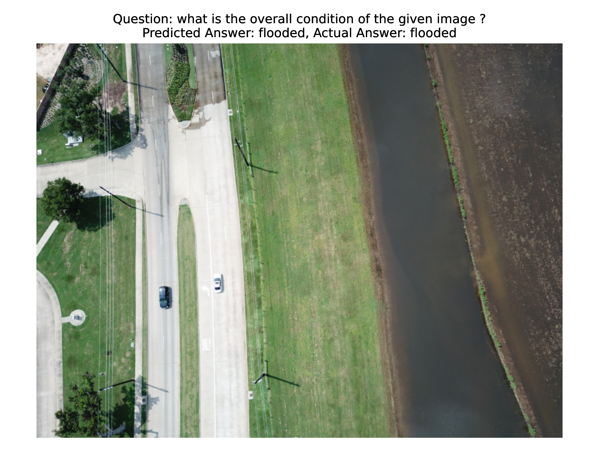
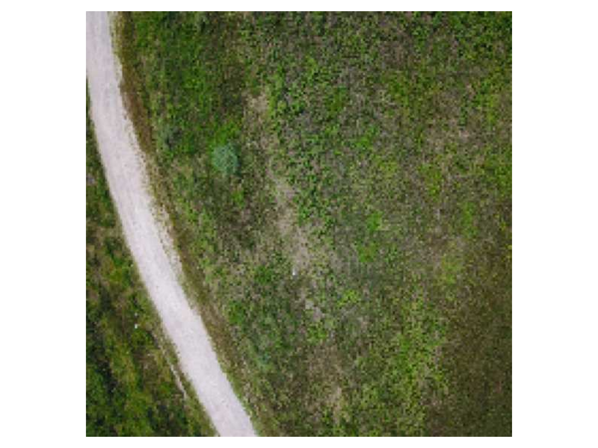
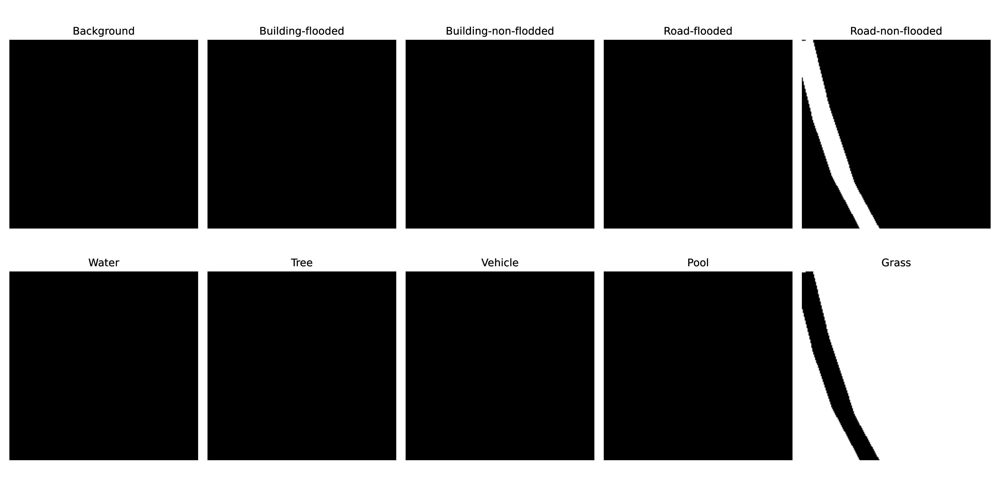
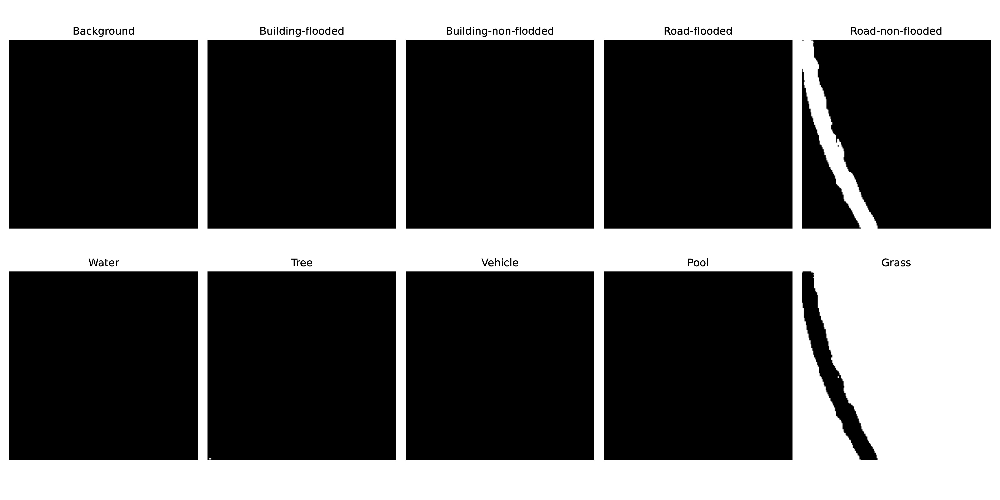
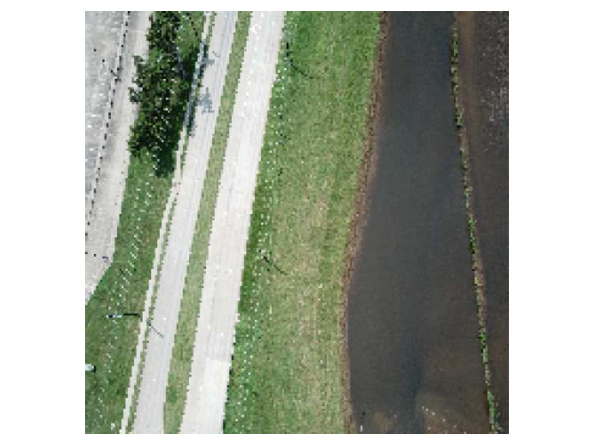
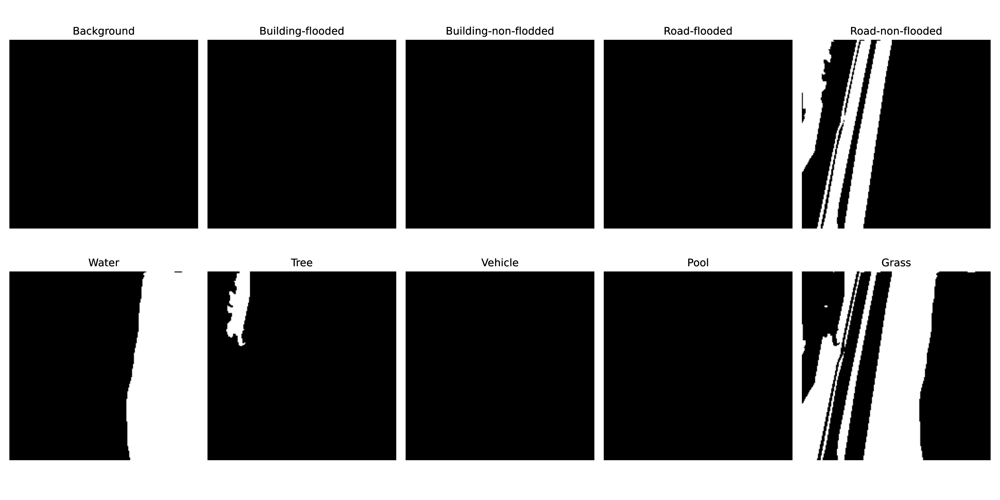
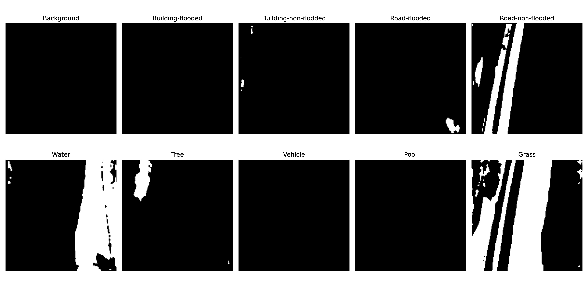
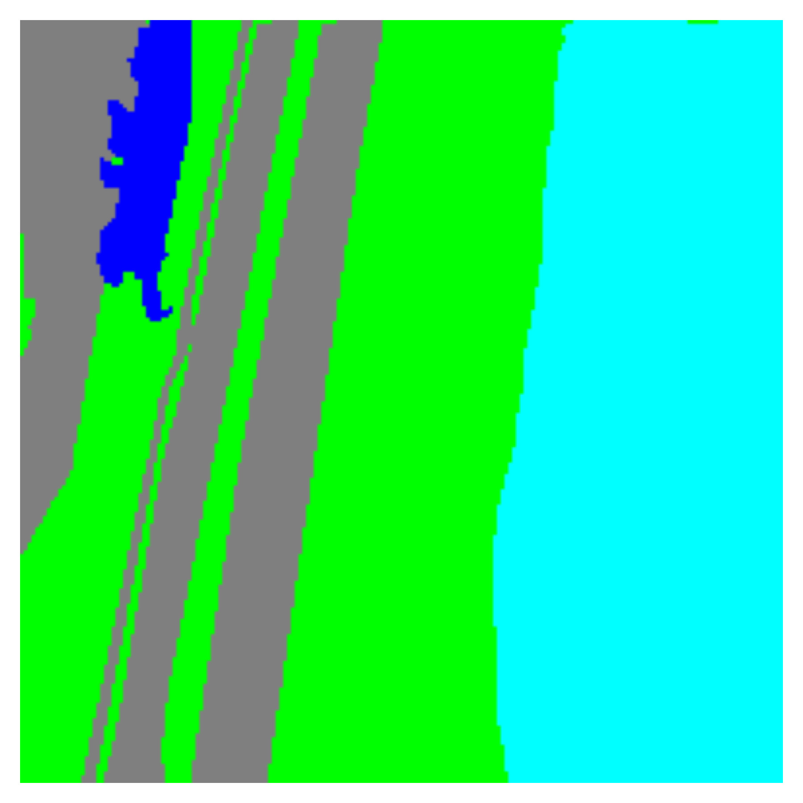
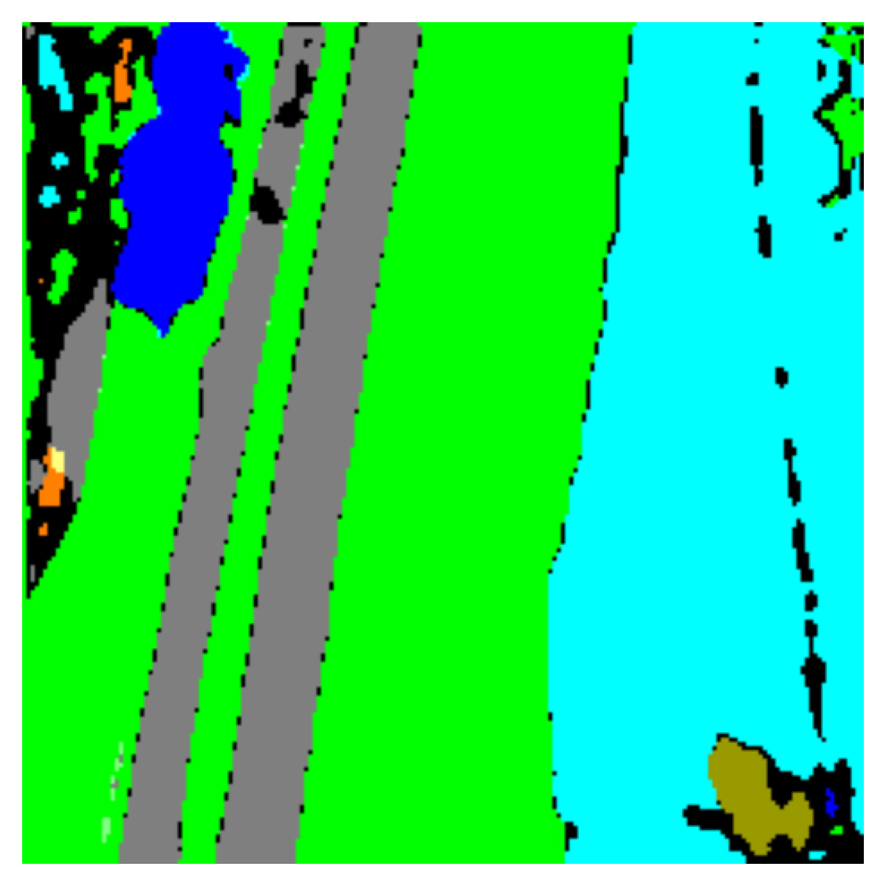

# DATWEP
Source code for the **Dynamic Task and Weight Prioritization Curriculum Learning for Multimodal Imagery** paper (currently under review). 

## Setup
Create a new Python environment

```console
$ conda create -n datwep python=3.10 -y
```
Activate created environment

```console
$ conda activate datwep
```

Install dependencies
```console
$ pip install -r requirements.txt
```


## Dataset
Download the FloodNet dataset from below (Both Track 1 and 2):
* https://github.com/BinaLab/FloodNet-Challenge-EARTHVISION2021

## Arrange the downloaded data files
Data directory should have the following structure:

#### Segmentation (Track 1)
* **FloodNet/track1_seg/train-label-img/** 
    * (Segmentation Masks)

#### Visual Question Answering (VQA) (Track 2)
* **FloodNet/track2_vqa/Images/**
    *  (VQA images, also used in segmentation) 

* **FloodNet/track2_vqa/Questions/** 
    * (VQA questions)

If you prefer another directory, then you should set the **DATA_ROOT** in Training.ipynb notebook.

```python
hyperparameters['DATASET']['DATA_ROOT'] = '../../data/'
```

## Experiments
1. After setting up the dataset, run the jupyter server locally:

```console
$ jupyter lab
```

2. Open **Training.ipynb** notebook, make sure correct data folders are set. This notebook will train the model and save the results. 

3. After training is complete, open **Evaluation.ipynb** notebook and run to see the final results.

## Contact
If you have any questions, feel free the contact us:

H. Fuat Alsan (PhD Candidate)
huseyinfuat.alsan@stu.khas.edu.tr

Assoc. Prof. Dr. Taner Arsan (Computer Engineering Department Chair)
arsan@khas.edu.tr


## If you use our work, please cite us:
(PAPER STILL UNDER REVIEW, WILL BE UPDATED LATER)

## Prediction Examples
#### VQA Example Prediction


### Segmentation Example 1
#### Acutal Image


#### Acutal Masks


#### Predicted Masks


#### Acutal Masks (Combined Color)


#### Predicted Masks (Combined Color)


### Segmentation Example 2
#### Acutal Image


#### Acutal Masks


#### Predicted Masks


#### Acutal Masks (Combined Color)


#### Predicted Masks (Combined Color)

